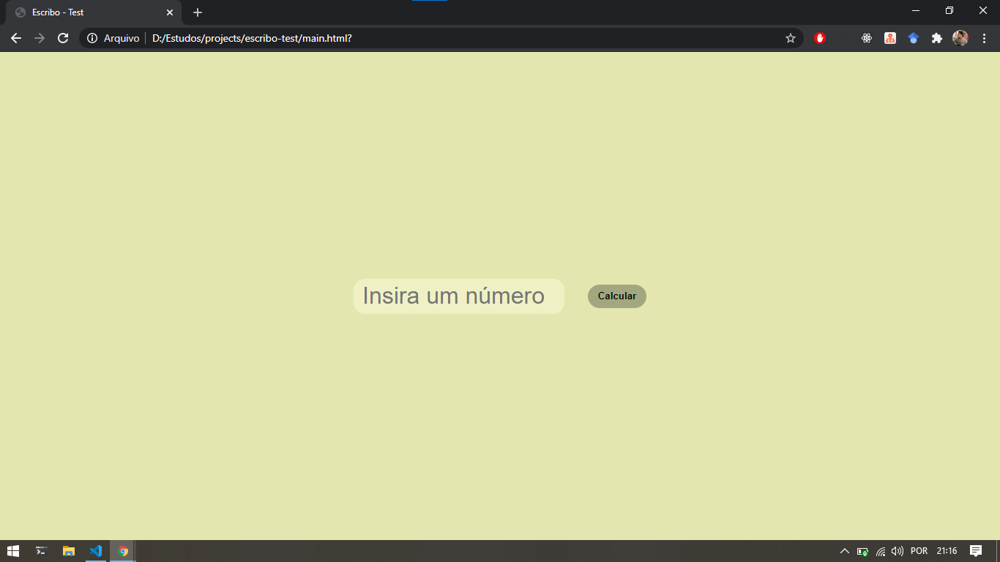
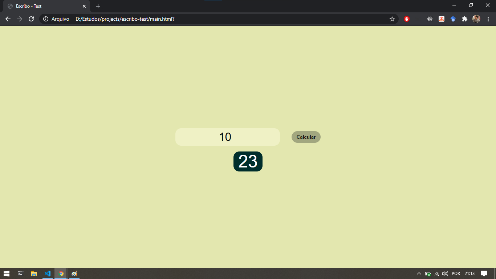
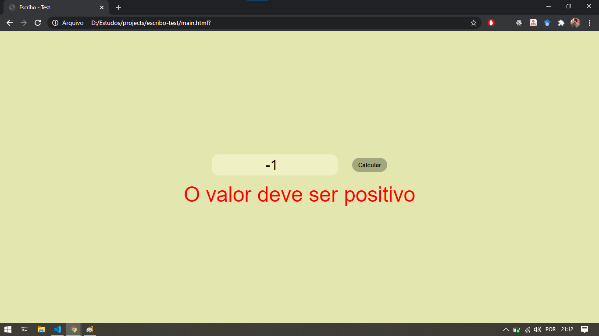

# Sobre
Este repositório consiste em criar uma função que receba um valor, sendo ele inteiro e positivo, e somar todos os números menores que o valor passado, divisíveis por 3 ou 5.

# Telas
## Tela de início

## Tela com soma

## Tela de erro

# Como rodar a aplicação?
Para rodar a aplicação na sua máquina basta abrir o arquivo main.html